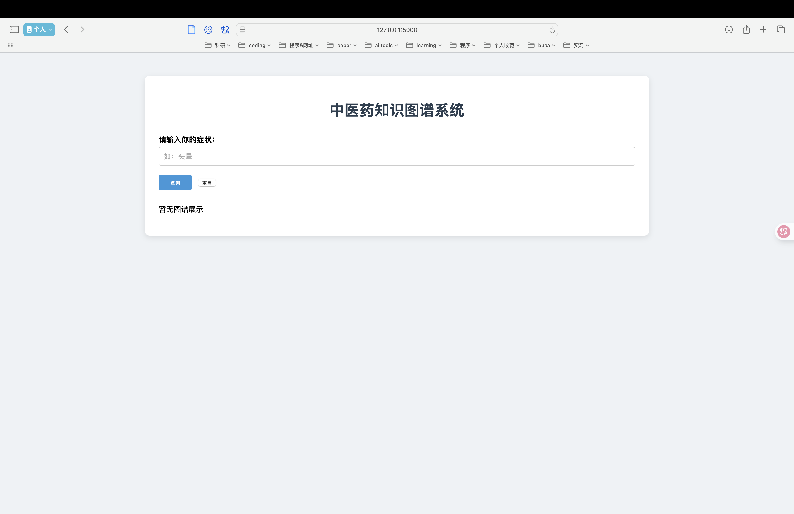
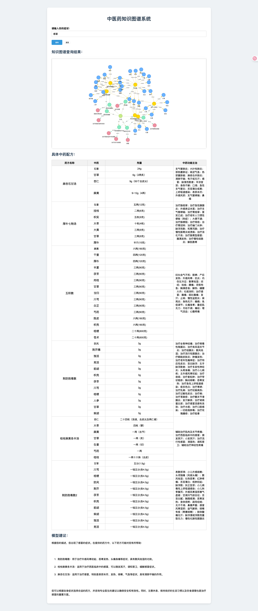

# 中医药知识图谱系统

本项目旨在构建一个基于中医药数据的知识图谱，并提供可视化和问答功能的 Web 界面，实现用户输入症状后自动推荐相关中药配方。


---

## 📁 项目结构

```
.
├── build/                 # 图谱构建与数据处理模块
│   ├── Crawler/           # 中医药数据抓取脚本（如 tcm_crawler.py）
│   ├── data/              # 原始与清洗后数据
│   │   ├── cleaned_data/  # 清洗后的数据
│   │   ├── crawled_data_raw/ # 原始抓取结果
│   │   ├── combine.py     # 数据合并脚本
│   │   ├── data_clean.py  # 数据清洗脚本
│   │   ├── TCM.json       # 主数据文件
│   │   └── tcm_knowledge_graph_1.json # 图谱中间结构
│   ├── KG_build.py        # 图谱构建主程序
│   └── TCM.dump           # 构建结果输出
├── Script/
│   └── answer.py          # 基于大模型的问答脚本
├── UI/                    # 用户界面模块
│   ├── app_origin.py      # 原始版本（仅图谱查询）
│   ├── app_answer.py      # 增强版本（图谱 + 模型建议）
│   ├── lib/               # 第三方可视化库等
│   ├── static/            # 前端静态资源（如图谱HTML）
│   └── templates/         # HTML 模板页面
│       ├── index.html
│       └── index_answer.html
├── readme.md              # 项目说明文档
├── requirements.txt       # Python 依赖说明
```

---

## 🚀 核心功能

- 🔍 用户输入症状，系统返回推荐中药配方
- 🌐 图谱可视化展示症状与中药的关系网络
- 🤖 集成大模型自动生成治疗建议（通过 `answer.py` 实现）

---

## 🛠 技术栈

- 后端：Python, Flask
- 图谱构建与可视化：NetworkX, PyVis
- 前端：HTML, CSS, JavaScript
- 大模型接入：通过子进程调用本地或远程模型脚本

---

## 🔧 使用方法

1. 启动 Neo4j 服务：

   请确保本地已安装并运行 Neo4j 图数据库，可通过以下命令启动：

   ```bash
   neo4j start
   ```

   默认服务地址为：`bolt://localhost:7687`，用户名密码配置请在代码中调整。

2. 安装依赖：

   ```bash
   pip install -r requirements.txt
   ```

3. （可选）重新构建知识图谱：

   ```bash
   cd build
   python KG_build.py
   ```

4. 启动服务：
   
   ```bash
   cd UI
   python app_answer.py  # 启动包含模型建议的版本
   ```
   ```bash
   cd UI
   python app_origin.py  # 启动不包含模型建议的版本
   ```

5. 访问 Web 页面：

   ```
   http://localhost:7687
   ```

---


---

## 📌 注意事项

- 本项目为教学和科研用途，所提供建议不可直接用于临床医疗。
- 若需接入自定义大模型，请根据 `Script/answer.py` 接口进行调整。

---

本系统融合中医药知识图谱与大语言模型能力，为症状与药方间的关联探索提供智能交互方式。
